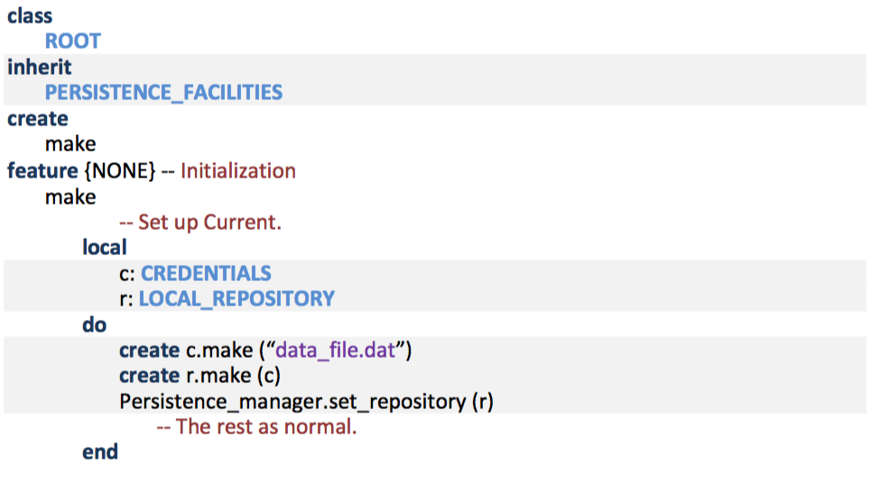
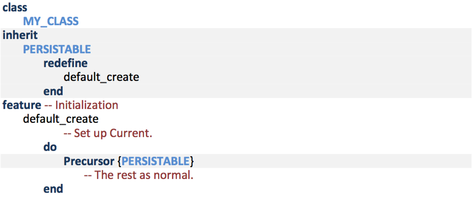
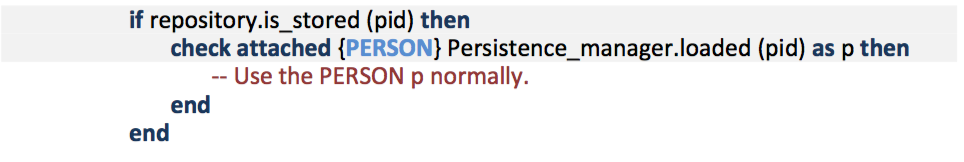

# P-Eiffel
P-Eiffel:  a library and runtime patch built with [EiffelStudio](https://www.eiffel.com) that adds automatic object persistence to Eiffel.

P-Eiffel extends the semantics of Eiffel to facilitate the automatic storage and retrieval of objects to and from long-term storage, eliminating almost all storage-related code from an Eiffel program and freeing the programmer to focus on the objective of the program. P-Eiffel provides the added functionality through a small change to the Eiffel runtime and a set of library classes, requiring no change to the Eiffel language or compiler.

This [dissertation](https://uknowledge.uky.edu/cs_etds/51/) has a thorough description of P-Eiffel.  Appendix B shows how to build and use P-Eiffel.

The [setup](setup) directory contains files to help get started with P-Eiffel.  The "build_PEiffel" script in the that directory can automate compilation, freezing, and movement of library files, but the environment variables must match your directory structure.

## Setup
To produce a P-Eiffel compiler, apply the patch file from the [setup](setup) directory to the Eiffel Software GPL source code, and compile the modified code with an Eiffel compiler. Include the persistence framework classes in a project and compile it with the new, modified compiler.  To build P-Eiffel:

1. Download:
   - [runtime patch](setup/auto_persistence_18_07.patch) and 
   - [framework](framework).
2. Download the Eiffel compiler from:
   - [EiffelStudio](https://www.eiffel.com).
3. Download compatable EiffelStudio source into an $EIFFEL_DEV directory:
   - [EiffelStudio source code](https://svn.eiffel.com/eiffelstudio/branches/Eiffel_18.07/)
4. Apply the patch in the $EIFFEL_DEV directory:
   - cd $EIFFEL_DEV/Src
   - patch –p0 < /location-of-patch-file/auto_persistence_18_07.patch
5. Compile the new runtime, runtime libraries, and compiler:
   - See instructions at [dev.eiffel.com](https://dev.eiffel.com/Compiling_EiffelStudio), or
   - Run the [build_PEiffel script]() set up for your environment.
6. Run the new EiffelStudio and include the [framework](framework) in the project.

## Use
Before any persistence operations, automatic or manual, the program must connect to a repository, preferably in the creation feature of the root class. The root class should inherit from PERSISTENCE_FACILITIES and call set_repository. The creation feature of the REPOSITORY class sets up the underlying physical datastore.

Additionally, classes describing objects that are automatically persistable should inherit from class PERSISTABLE, calling the precursor version of default_create.

The following segment shows the minimal code required to retrieve an object given its PID (i.e. persistent identifier).

## Dependencies
The library currently depends on the JJ\_TEMPORAL classes found [here](http://github.com/boxer41a/jj_temporal).
 
The demo does not run to completion now because I added support for tracking ancestor and descendent types but failed to fix the `loaded' feature.  (It needs to recursively update the types table when a type is encounterred in the ancestors or descendents of an object's type.) 

